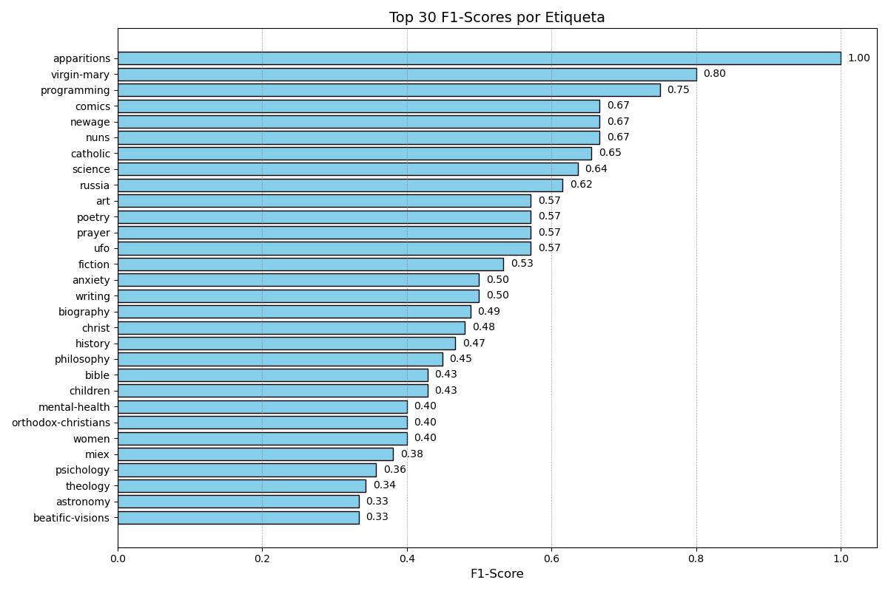

# 📚 **BiblioNLP: Automatic Tagging & Semantic Book Discovery**

*Unlock the power of AI to tag, cluster, and recommend books seamlessly.*

[](https://www.python.org/)
[](LICENSE)
[](https://www.nltk.org/)
[](https://huggingface.co/)
[](https://keras.io/)
[](https://www.tensorflow.org/)

BiblioNLP is an **AI-powered platform** that combines **Natural Language Processing (NLP)** and **Machine Learning** to transform how we explore books. From **automatic tagging** to **sentiment analysis** and **semantic recommendations**, this project showcases cutting-edge techniques to enhance book discovery.


## 🤖🏷️ Automatic Tag Generator

This is an example of how the model is used to predict labels from book titles and descriptions.

```python
# Ejemplo de predicción de etiquetas
new_titles = [
    "Cosmos",
    "Clean Code",
    "True Devotion to Mary",
    "The Divine Comedy",
    "Fear and Trembling",
    "Pride and Prejudice",
    "The Diary of a Young Girl",
    "The History of the Decline and Fall of the Roman Empire",
    "Republic",
    "The Story of Art"
]

new_blurbs = [
    "Carl Sagan’s groundbreaking exploration of the universe, tracing humanity’s quest to understand the cosmos.",
    "Robert C. Martin’s influential guide to writing clean, understandable, and maintainable code.",
    "St. Louis de Montfort’s enduring spiritual classic, reflecting on the profound significance of devotion to the Virgin Mary.",
    "Dante Alighieri’s epic poem traversing Hell, Purgatory, and Heaven, illuminating the depths of human nature and redemption.",
    "Søren Kierkegaard’s seminal work on existential anxiety, faith, and the leap beyond rational understanding.",
    "Jane Austen’s beloved novel about love and social expectations in Georgian England.",
    "Anne Frank’s harrowing yet hopeful personal account of life in hiding during World War II.",
    "Edward Gibbon’s exhaustive chronicle tracing the factors behind the collapse of the Roman Empire.",
    "Plato’s foundational philosophical dialogue exploring justice, society, and the ideal state.",
    "E. H. Gombrich’s accessible survey tracing the evolution of art from prehistoric times to the modern era."
]

predicted_tags = predict_tags(new_titles, new_blurbs)
print(predicted_tags)
```

### 🧾 Output

```text
['astronomy', 'creation', 'philosophy', 'physics', 'science', 'space']
['programming']
['apparitions', 'biography', 'catholic', 'classics', 'devotional', 'france', 'holiness', 'illustrated', 'nuns', 'saints', 'spirituality', 'virgin-mary', 'women']
['catholic', 'classics', 'medieval', 'poetry', 'spirituality']
['anxiety', 'christianity', 'mental-health', 'miex', 'nonfiction', 'philosophy', 'psichology', 'selfhelp', 'suffering', 'theology']
['apologetics', 'biography', 'classics', 'courtship', 'emotional-relationships', 'essays', 'family', 'fiction', 'history', 'hope', 'love', 'marriage', 'philosophy', 'poetry', 'psichology', 'romance', 'selfhelp', 'virtues', 'women']
['biography', 'classics', 'fiction', 'memoir', 'psichology', 'romance', 'women']
['anti-catholics', 'church-history', 'communism', 'essays', 'history']
['allegories', 'ancient-literature', 'classics', 'greek', 'history', 'philosophy', 'politics', 'virtues', 'women']
['art', 'essays']
```

## 🚀 Instalación y Uso

### 1. Clona el Repositorio

```bash
git clone https://github.com/tu-usuario/BiblioNLP-Automatic-Tagging-Semantic-Book-Search.git
cd BiblioNLP
```

### 2. Instala Dependencias

```bash
# Activa el entorno del proyecto
rm -rf .venv
python3 -m venv .venv
source .venv/bin/activate
pip install --upgrade pip
pip install -r requirements.txt --progress-bar on

# Si ya existe el entorno, puedes actualizar librerías según el requirements
pip install --upgrade --no-deps -r requirements.txt

# [Si fuese necesario] Algunas dependencias en el entorno global
/usr/bin/python3 -m pip list
/usr/bin/python3 -m pip install pinecone
/usr/bin/python3 -m spacy download en_core_web_sm
/usr/bin/python3 -m spacy download es_core_news_sm
/usr/bin/python3 -m pip install tensorflow==2.19.0

# Regenerar modelos para la app
python src/regenerate_sentiment_model.py
python src/regenerate_semantic_search.py
python src/regenerate_keras.py

# Apertura app
streamlit run src/app_streamlit.py --server.runOnSave true
```

### 3. Configura Variables de Entorno

```bash
export MYSQL_USER="tu_usuario"
export MYSQL_PASS="tu_contraseña"
export PINECONE_API_KEY="tu_api_key"
```

## 🛠 Técnicas y Modelos

### 1. **Pipeline de Generación de Etiquetas**

- **Input**: Combina títulos y descripciones de libros en un único campo de texto.
- **Embeddings**: Generados con `SentenceTransformer` usando el modelo multilingüe `paraphrase-multilingual-MiniLM-L12-v2`.
  - URL en Hugging Face: [sentence-transformers/paraphrase-multilingual-MiniLM-L12-v2](https://huggingface.co/sentence-transformers/paraphrase-multilingual-MiniLM-L12-v2)
- **Clasificador**: Modelo de **Logistic Regression** envuelto en un `MultiOutputClassifier` para clasificación multilabel.
- **Output**: Predice etiquetas relevantes (ej. `philosophy`, `science`, `astronomy`).


#### Model Evaluation

- **Distribución de Etiquetas**: Visualiza los **top-30 scores** por etiqueta para entender tendencias.



- **Precisión por Muestra**: Analiza la precisión del modelo con un histograma de **accuracy per sample**.


### 2. **Pipeline de Análisis de Sentimientos**


- **VADER**:
  - Herramienta basada en reglas para análisis de sentimientos.
  - Calcula puntajes de polaridad (`positive`, `negative`, `neutral`, `compound`).
- **RoBERTa**:
  - Modelo preentrenado (`j-hartmann/emotion-english-distilroberta-base`).
  - Detecta emociones como `joy`, `sadness`, `anger`, `fear`, etc.
  - Aplicado a descripciones de libros para obtener insights emocionales.

### 3. **Clustering**

Agrupa libros por similitud semántica usando **K-Means** y visualiza la distribución.


### 4. **Funciones Reutilizables**

- **`predict_tags`**:
  - Predice etiquetas para nuevos libros basándose en sus títulos y descripciones.
  - Clasificación multilabel con umbral ajustable.
- **`mooder`**:
  - Aplica RoBERTa para extraer puntajes de emociones desde texto.                         |

## 🙌 Contribuciones

¡Las contribuciones son siempre bienvenidas!

1. Haz un fork del proyecto.
2. Crea una rama para tu feature o bugfix (`git checkout -b nombre-rama`).
3. Haz commit de tus cambios (`git commit -m 'Agrego nueva funcionalidad'`).
4. Sube la rama (`git push origin nombre-rama`).
5. Abre un Pull Request detallando tus cambios.

## ⚖️ Licencia

Este proyecto se distribuye bajo la licencia [MIT](LICENSE). ¡Siéntete libre de usarlo y mejorarlo!

> **Nota:** Este repositorio es parte de un proyecto de aprendizaje e investigación de NLP, por lo cual no garantiza escalabilidad de producción sin ajustes adicionales.

¡Gracias por visitar **BiblioNLP** y que disfrutes explorando el mundo de los libros con NLP! 🎉
