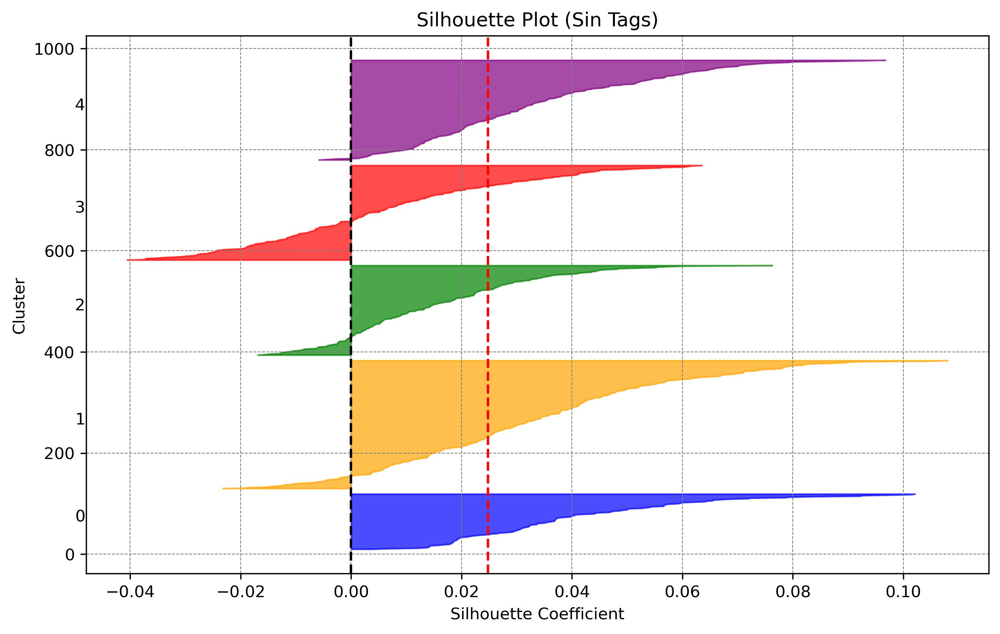
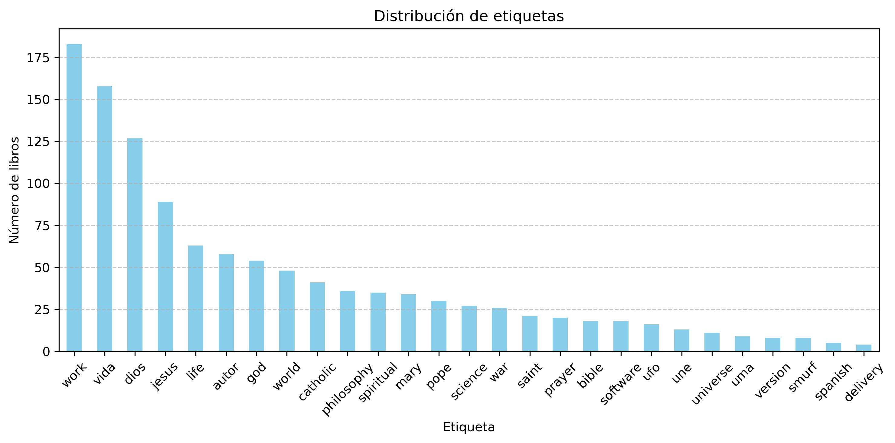

# 📚 **BiblioNLP: Automatic Tagging & Semantic Book Discovery**

*Unlock the power of AI to tag, cluster, and recommend books seamlessly.*

[](https://www.python.org/)
[](LICENSE)
[](https://www.nltk.org/)
[](https://huggingface.co/)
[](https://keras.io/)
[](https://www.tensorflow.org/)

BiblioNLP is an **AI-powered platform** that combines **Natural Language Processing (NLP)** and **Machine Learning** to transform how we explore books. From **automatic tagging** to **sentiment analysis** and **semantic recommendations**, this project showcases cutting-edge techniques to enhance book discovery.


---

| **Técnica Clave**                          | **Visualización**                                                                 |
|--------------------------------------------|-----------------------------------------------------------------------------------|
| **Clustering**: Agrupa libros por similitud semántica usando **K-Means** y visualiza la distribución. |   |
| **Análisis de Sentimientos**: Detecta emociones como `joy`, `sadness`, y `anger` en descripciones de libros con **RoBERTa**. |                                    |
| **Distribución de Etiquetas**: Visualiza los **top-30 scores** por etiqueta para entender tendencias. |                                      |
| **Precisión por Muestra**: Analiza la precisión del modelo con un histograma de **accuracy per sample**. |                           |

---

## 🚀 Instalación y Uso

### 1. Clona el Repositorio

```bash
git clone https://github.com/tu-usuario/BiblioNLP-Automatic-Tagging-Semantic-Book-Search.git
cd BiblioNLP
```

### 2. Instala Dependencias

```bash
# Activa el entorno del proyecto
rm -rf .venv
python3 -m venv .venv
source .venv/bin/activate
pip install --upgrade pip
pip install -r requirements.txt --progress-bar on

# Si ya existe el entorno, puedes actualizar librerías según el requirements
pip install --upgrade --no-deps -r requirements.txt

# [Si fuese necesario] Algunas dependencias en el entorno global
/usr/bin/python3 -m pip list
/usr/bin/python3 -m pip install pinecone
/usr/bin/python3 -m spacy download en_core_web_sm
/usr/bin/python3 -m spacy download es_core_news_sm
/usr/bin/python3 -m pip install tensorflow==2.19.0

# Regenerar sentimientos:
python src/regenerate_sentiment_model.py
```

### 3. Configura Variables de Entorno

```bash
export MYSQL_USER="tu_usuario"
export MYSQL_PASS="tu_contraseña"
export PINECONE_API_KEY="tu_api_key"
```

### 4. Ejecuta un Script de Prueba

#### Generación de Etiquetas

```bash
python src/tagging/main.py
```

#### Análisis de Sentimientos

Ejecuta el notebook `notebooks/nlp_sentiment_analysis_books_pipeline_es.ipynb` para realizar análisis exploratorio de sentimientos.

#### Búsqueda Semántica

```bash
python src/search/semantic_search.py --query "magia y aventuras"
```

---

## 🛠 Técnicas y Modelos

### 1. **Pipeline de Generación de Etiquetas**

- **Input**: Combina títulos y descripciones de libros en un único campo de texto.
- **Embeddings**: Generados con `SentenceTransformer` usando el modelo multilingüe `paraphrase-multilingual-MiniLM-L12-v2`.
  - URL en Hugging Face: [sentence-transformers/paraphrase-multilingual-MiniLM-L12-v2](https://huggingface.co/sentence-transformers/paraphrase-multilingual-MiniLM-L12-v2)
- **Clasificador**: Modelo de **Logistic Regression** envuelto en un `MultiOutputClassifier` para clasificación multilabel.
- **Output**: Predice etiquetas relevantes (ej. `philosophy`, `science`, `to-read`).

### 2. **Pipeline de Análisis de Sentimientos**

- **VADER**:
  - Herramienta basada en reglas para análisis de sentimientos.
  - Calcula puntajes de polaridad (`positive`, `negative`, `neutral`, `compound`).
- **RoBERTa**:
  - Modelo preentrenado (`j-hartmann/emotion-english-distilroberta-base`).
  - Detecta emociones como `joy`, `sadness`, `anger`, `fear`, etc.
  - Aplicado a descripciones de libros para obtener insights emocionales.

### 3. **Funciones Reutilizables**

- **`predict_tags`**:
  - Predice etiquetas para nuevos libros basándose en sus títulos y descripciones.
  - Clasificación multilabel con umbral ajustable.
- **`mooder`**:
  - Aplica RoBERTa para extraer puntajes de emociones desde texto.

---

## 📊 Ejemplo de Resultados

### Generación de Etiquetas

```python
new_titles = ["La conspiración del universo"]
new_blurbs = ["Una historia que entrelaza ciencia, fe y filosofía para revelar los secretos de la creación."]
predicted_tags = predict_tags(new_titles, new_blurbs)
print(predicted_tags)
# Output: [('philosophy', 'science', 'to-read')]
```

### Análisis de Sentimientos

- **VADER**: Visualiza la distribución de sentimientos (`compound` scores).
- **RoBERTa**: Analiza emociones como `joy` o `sadness` en descripciones de libros.

---

## 🛠 Streamlit

```python
streamlit run src/app_streamlit.py --server.runOnSave true
```

## 🙌 Contribuciones

¡Las contribuciones son siempre bienvenidas!

1. Haz un fork del proyecto.
2. Crea una rama para tu feature o bugfix (`git checkout -b nombre-rama`).
3. Haz commit de tus cambios (`git commit -m 'Agrego nueva funcionalidad'`).
4. Sube la rama (`git push origin nombre-rama`).
5. Abre un Pull Request detallando tus cambios.

---

## ⚖️ Licencia

Este proyecto se distribuye bajo la licencia [MIT](LICENSE). ¡Siéntete libre de usarlo y mejorarlo!

---

> **Nota:** Este repositorio es parte de un proyecto de aprendizaje e investigación de NLP, por lo cual no garantiza escalabilidad de producción sin ajustes adicionales.

¡Gracias por visitar **BiblioNLP** y que disfrutes explorando el mundo de los libros con NLP! 🎉 